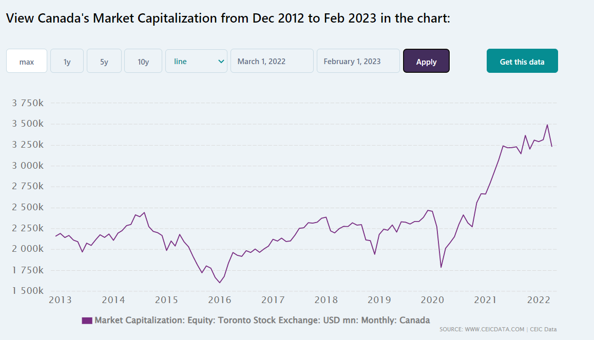
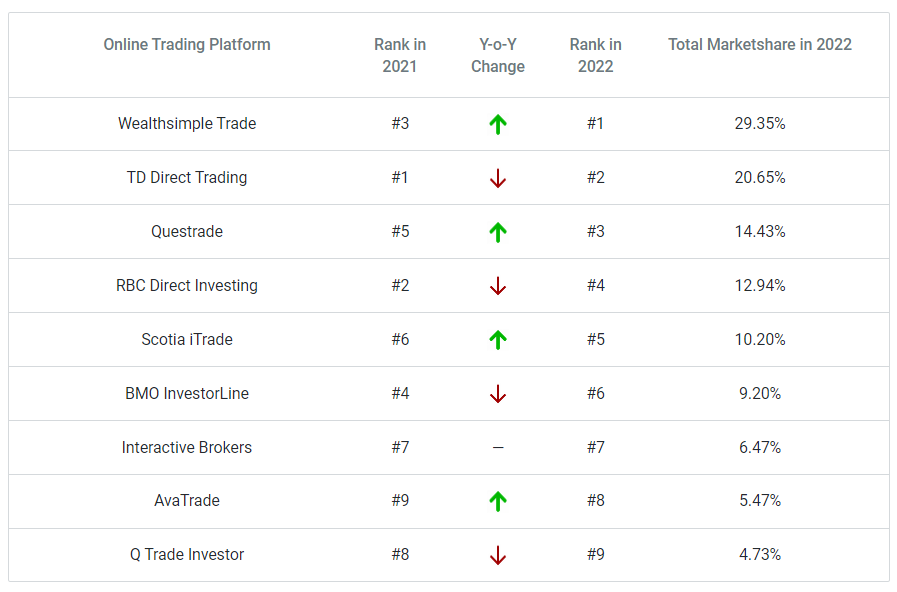

# WEALTHSIMPLE INC.
## OVERVIEW AND ORIGIN
### Wealthsimple is a Canadian investment firm, based in Toronto, ON, which provides investments solutions through their platform for trading stocks, EFTs, options, cryptocurrencies and other investment products in Canada and the USA. The company was incorporated in September in 2014 by Michael Katchen, Brett Huneycutt and Rudy Adler. The vision behind establishing the company is to mitigate the barriers that are present in the traditional IRA or managed fund for most people for their engagement in the investment market. They also provide the features and tools that mostly the rich society have access to, in a simpler fashion with the increased affordability. The organization had its initial funding of $2 Million to start its operations. The investors who pitched in to raise this amount are Joe Canavan, Roger Martin, David Ossip, Dan Debow and Canadian venture capital firm Impression Ventures.
---
## BUSINESS ACTIVITIES
### Wealthsimple primarily focuses on the retail investors among the millennials (people of age between 23 and 38) as opposed to the conventional investment system’s target ages from 45 and above. The business model of the organization allows the client to trade with zero commissions with no requirements of the minimum balances. This solves the most fundamental problem that company aims to resolve, which is providing access to the market for the millennials and helping them start at the earliest possible stage. The platform has savings and checking accounts of no minimum deposit requirement available with interest provided. This is provided through the business stream called *Wealthsimple cash*, where the clients can directly deposit money or their payroll to wealth simple account. They also provide free online tax return software to the clients. Theses features provide capabilities to the clients to create and hold their wealth paving path for further involvement in the market and wealth generation.

### The knowledge of the client on the market and instruments involved is perceived of importance by the organization. Although the clients can opt to invest hands-on in the market through the platform, it also provides its state-of-the-art Robo advisors to the clients. Wealth Simple holds the most upper hand and unfair advantage over its competitors in this arena. It is the best in class available to the retail investors in Canada, made possible with the incorporation of cutting-edge technology. The investors can choose to have the robo advisors to automatically allocate funds in accordance with the strategies and portfolio designed by financial experts, primarily with mutual funds and EFTs for a much probable steady growth over long term. These are done with maximised savings on the taxes.  This advising service is charged as low as around 0.5% as opposed to 2% and higher most seen in the traditional system.

### There are several technologies used by Wealthsimple to run its operations. These technologies and its purposes are listed below.

| PURPOSE | TOOLS AND SOFTWARE |
| ----------- | ----------- |
| Analytics | Periscope |
| Application Hosting   | Amazon EC2, AWS Lambda, NGINX, AWS Elasric Beanstalk |
| Application Utilities | Postman, SwaggerHub, Swagger Inspector, AWS IAM, AWS Data Pipeline, TensorFlow, Algolia |
| Assets and Media | Amazon CloudFront, Google Drive |
| Collaboration | Slack, Jira, Azure Active Directory, 1Password |
| Communications | Amazon SNS |
| Data Stores | Sidekiq, Amazon Redshift, Amazon S3, PostgreSQL, Oracle, Redis, Amazon SQS, Hibernate, Amazon RDS |
| Design | Figma |
| Development | GitHub, CircleCI, gulp, AWS Ekastic Load Balancing, Consul, zookeeper, Ansible, Git, Virtualbox, Nomad, Rundeck |
| Language and Frameworks | React Native, Sass, Ruby on Rails, Bootstrap, JavaScript, HTML5, Java, ES6, CSS 3, Ruby, GraphQL |
| Libraries | React, AngularJS, Redux |
| Marketing and sales tools | Zendesk |
| Monitoring | Amazon CloudWatch, Rollbar, ELK, PagerDuty, Datadog |
---
## LANDSCAPE OF THE INDUSTRY
### Wealthsimple is an active and leading player in the online capital investment sector for retail investors and traders. Canadian economy has a market capitalization of USD 2.9 Trillion as of February, 2023.  This economy is diverse and has shown upward trend over the time. The following shows the chart of how the Canadian market has performed in the last 10 years published by ‘CEIC Data’.

### The trading of stocks has been present over a century. The orders for the trade were placed by calling them out at the place of exchange and handing over the orders to the brokers directly. The process was revolutionised with the introduction of telephones into the scenario up until the 1990s. This is when the online trading and its related platforms gained it rapid popularity.  The trading platforms essentially act as an online broker which allow the investors to buy and sell an assortment of financial securities. There are several platforms available in the market with their own policies, features and facilities. It has now become easier than ever to open, close and manage the trading accounts without the physical presence at the exchange. The *Investment Industry Regulatory Organization of Canada* is the entity that monitors the trading activities in the market to enforce the law.
### These trading platforms are classified into two categories.
- 	Commercial Platforms:
### These platforms are made for the public to get involved in the market. The retail investors signing up for these platforms would receive aspects, including but not limited to, real time price quotes, research tools, interactive charts, educational contents and news feeds. 
- 	Proprietary Platforms:
### These are developed with exclusive access to the large financial institutions and brokerages to carry out their activities. The public would not have to access these.
### Wealthsimple compete among the commercial platforms for online trading in the market where the retail investors can gain access to. 

### The online trading platform has been growing profoundly especially in the last few years. The chart below shows the trend from 2019 to 2022 and the projection till the year 2030 in the market size of online trading platforms across North America published by *Fortune business insights*, under Report ID FBI104934.

### *Fortune business insights* estimates in the same report that *”the global online trading platform market size would grow from USD 9.94 Billion in 2023 to 15.34 Billion by 2023 exhibiting a CAGR of 6.4% during the forecast period.”*

### The latest trend that has been mainly emerging in the last few years is the innovation and application of the technology to provide advise to client and even provide fund allocation on the basis of algorithms. In the race of providing the maximum value to the clients, these organizations in the market have already launched features which involve Artificial Intelligence in the form of robo advisors. The machine learning models that these features use will be trained with past data to obtain predictions of higher accuracy. This trend would also help analysts in obtaining the insights that may help them make decisions for higher returns at lower risks. Although there are benefits in using this technology, the regulations in Canada have made it difficult to deploy at full scape presently.

### One of the main problems that is faced by the investors in Canada is the high fee charged by the fund managers which could eat into the profits that these investors would make. The median manager fee is reported to be 1.5% by the *Morningstart* in 2019 which is cited by Canterbury Consulting in its white paper titled *”Canada’s equity investment landscape”*. There is ongoing trend where the companies have been offering the public with services at the lowest fee possible at in some cases where there is no fee at all to solve this problem and be more appealing. Canadian brokers face the challenge in making the best with low fee or zero commission services as Canadian regulations restrict the Payment of Order Flow (PFOF) model in the market. The PFOF is the model where the brokers redirect the orders they receive to the market makers, where they would carry out the order at a better price and shares the difference as profit between them to generate revenue for themselves. Marius Zoican, assistant professor of finance at the University of Toronto has said that "*As long as payment for order flow is not allowed in Canada, it would be difficult to have full-fledged zero-commission trading*", in an article Published on Reuters on Feb 09, 2021 By Nichola Saminather.

### The most visible of trends on the retail investor perspective in the last few years is the development of the desktop and mobile phone user interface. The has been new features and tools introduced into the respective platforms and for better customer experience and usability. It has been reported by *Fortune business insights*, under Report ID FBI104934, that there has been an increase in the demand web-based interface and mobile application downloads as it will help the clients to carry out analysis with tools, charts and reports and take positions in the market.

###  Some of the major competitors to Wealthsimple are Questrade, TD Direct trading, Interactive brokers, Qtrade and Scotia iTrade. All these companies have their own policies and features with distinct capabilities.
---
## RESULTS
### Wealthsimple is now an investment company that has assets under management of worth at approximately $17.5 Billion as of September, 2022 with a client base of estimated 3 million. It has created a wave in the retail investment market as being one of the first zero commission trading platforms where most of its competitors charge around $4.95 to up to $9.95 or more per trade. As per the article published on Finder.com by Romana King, Senior Finance Editor at Finder, in May 2023, titled *Statistics and Facts about Stock Market 2023* - a survey was performed called *Finder: World Stock Market Survey* by asking more than 1200 Canadians of which online platform they use to carry out the investing and trading activities in 2021. This question was repeated in the year 2022. The finding is that popularity of trading platforms can change over time. Wealthsimple was collectively ranked from 3 to 1 during this time among its competitors. The result of the survey is as follows.

### The absence of annual account fee is also an aspect that makes Wealthsimple stand out in its competition as most of the top players charge this fee. It is also commendable fact that Wealthsimle also provides he platform to trade crypto currencies as well, posing itself to be a complete package in the industry. However, even if the robo advisors and automated trade operations are cheaper compared to conventional methods in fees, there are platforms that provide this service at lower cost. Questrade could be taken as an example. The fair side of this scenario for wealth simple is that it stands closest to latest technologies and trends. It definitely stays as an advantage which can produce better results in its competion.
---
## RECOMMENDATIONS
### Wealthsimple had proven itself to be a very efficient platform that will help retail investors dive into the market to make their investments using the different tools that are available. However, it is recommended to have a section initiated where the clients could have a session with the traders directly on the play. Wealthsimple already provides certain materials and articles on its website which could be accessed for free. This is a great resource to make a foundational understanding of the concepts.  Michael Katchen, the founder and CEO of Wealthsimple, have stated in an article published by *The Globe and Mail* on February 10, 2021 that “*I fundamentally believe that, as a business that allows people to invest their savings in the market, we have a deep responsibility to our clients to help educate and empower them to make informed decisions. *”.  Focussing on this idea of wealth simple, for a higher transparency of the concept of investing and trading to the clients, providing the opportunity to witness how experts carry out their trades on live sessions would be very helpful. As a part of this dynamic activity, Q&A sessions could also be arranged. The chances of more clients signing up to the platform would also rise since there are all the materials along with live demonstration that could help them achieve knowledge and their financial goals along side the automated robo advisor financing. As these kinds of courses are usually provided with higher fee outside, making these available at lower fee to the clients would make it another stream of income to wealth simple. A communication platform will be required which could support video sharing for this purpose. A platform such as zoom would be a good fit due to its flexibility and features for lecturing and demonstration. Amazon Cloudfront is a technology that could be encompassed with it, as it provides the feature to share text files, charts, audio and video files related to the session conducted or as a prework to the session that is going to be conducted. As Amazon Cloudfront provides seamless content sharing with high data transfer speed and low latency the access to contents including the recordings of previous sessions could be made available to the clients with superior experience helping the organization in providing more value to them. 

---
## REFERENCES
The references are arranged and enlisted in accordance to the subtopics in the folder below.

[REFERENCES](REFERENCES)

